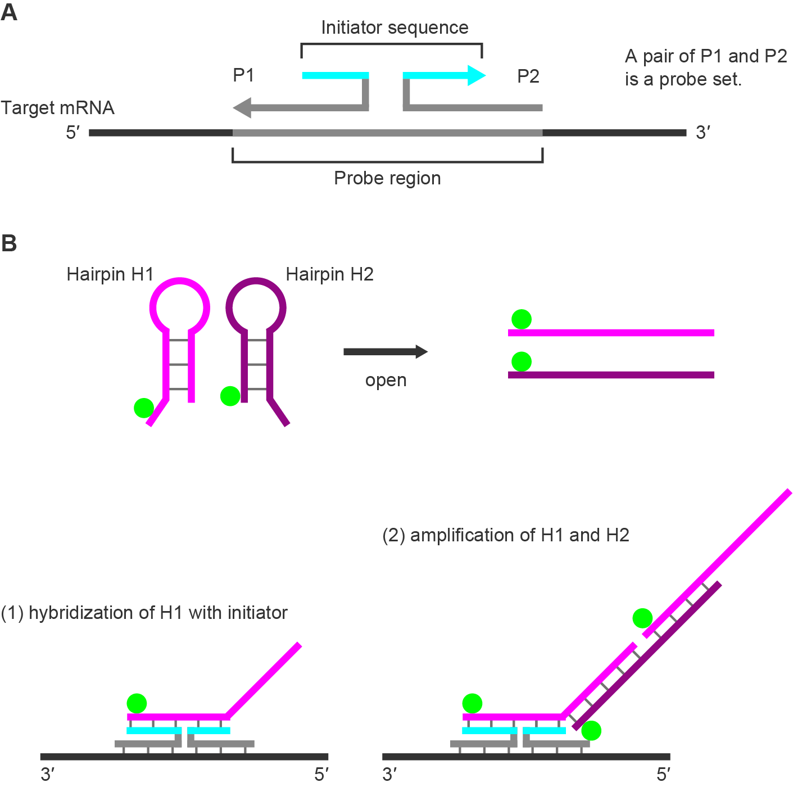
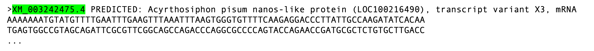
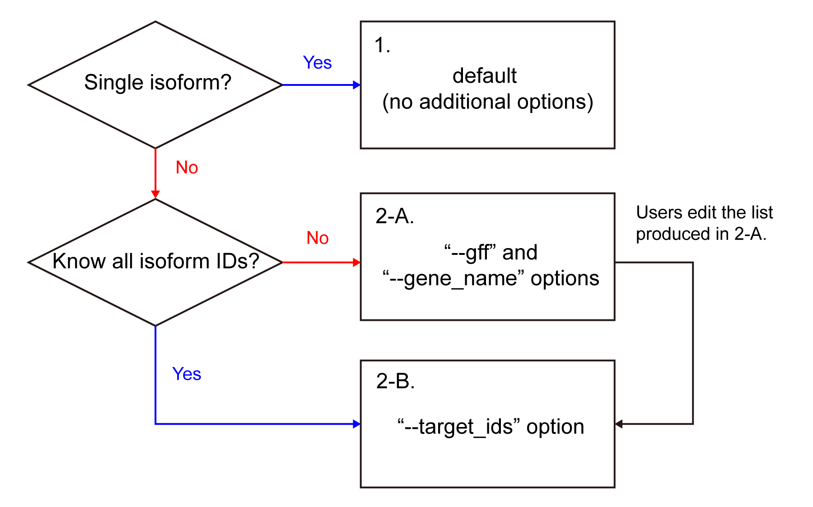
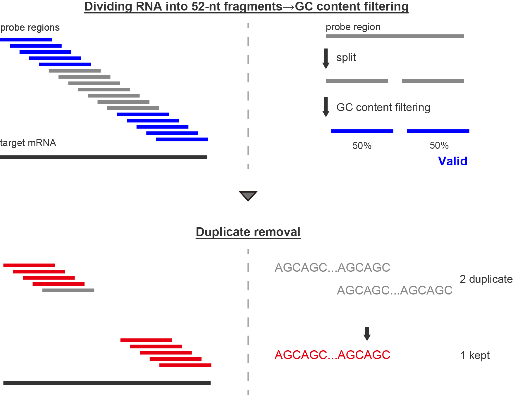
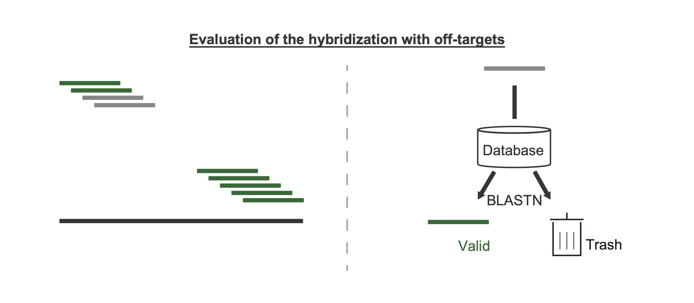
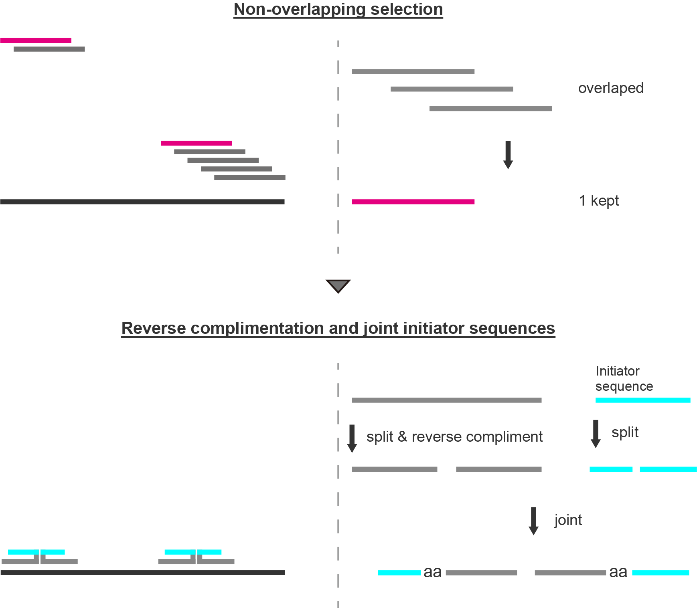

# Supplemental Information<!-- omit in toc -->

- [What is isHCR (*in situ* Hybridization Chain Reaction)?](#what-is-ishcr-in-situ-hybridization-chain-reaction)
  - [Guidline for design of probes](#guidline-for-design-of-probes)
- [Overview of `hcrkit`](#overview-of-hcrkit)
  - [How does `hcrkit` remove probe regions with off-target BLAST matches?](#how-does-hcrkit-remove-probe-regions-with-off-target-blast-matches)
    - [1. if there are no isoforms other than the target transcript (default)](#1-if-there-are-no-isoforms-other-than-the-target-transcript-default)
    - [2. if there are isoforms rather than target transcript](#2-if-there-are-isoforms-rather-than-target-transcript)
- [Workflow \& algorithm](#workflow--algorithm)
  - [Detect candidate probe regions based on GC content](#detect-candidate-probe-regions-based-on-gc-content)
  - [Remove probe regions with off-target BLAST matches](#remove-probe-regions-with-off-target-blast-matches)
    - [BLAST Search](#blast-search)
    - [Filter by Specificity](#filter-by-specificity)
  - [Perform several processes to generate final probes](#perform-several-processes-to-generate-final-probes)
    - [Select Non-overlapping Probe Regions](#select-non-overlapping-probe-regions)
    - [Generate Probe Pairs](#generate-probe-pairs)
  - [Write Outputs](#write-outputs)

## What is isHCR (*in situ* Hybridization Chain Reaction)?

_in situ_ hybridization chain reaction (isHCR), a type of _in situ_ hybridization (ISH), enables RNA detection across multiple spatial scales, from organs to subcellular structures. Unlike enzyme-based methods, isHCR visualize RNAs though formation of polymors composed of fluorescently-labeled oligonucleotides. 
The probe contains an initiator sequence (Figure SI1A). The initiator hybridizes with hairpin DNAs, triggering a hybridization chain reaction that produces fluorescently labeled polymers (Figure SI1B). To suppress background signals, the probe is split (P1 and P2), and the probe set can efficiently trigger amplification.

### Guidline for design of probes

- GC content: 40–60% (45–55% recomended)
- For each probe set, sequence identity with off-target RNAs: ≤ 50% (verify with BLAST)
- Design region in target RNA: CDS + UTR (CDS recomended)

||
|:-:|

 Figure SI1 

## Overview of `hcrkit`

`hcrkit` designs probes following the workflow below:

1. Detect candidate probe regions based on GC content
2. Remove probe regions with off-target BLAST matches
3. Perform several processes to generate final probes

### How does `hcrkit` remove probe regions with off-target BLAST matches?

`hcrkit` excludes candidate probe regions that show BLAST hits to off-target sequences. Because BLAST also returns hits to the intended on-target sequences, these on-target hits must be ignored when evaluating potential off-target matches. To enable this filtering, `hcrkit` first obtains the IDs of on-target sequences using three different methods described below (Figure SI2).

#### 1. if there are no isoforms other than the target transcript (default)

The on-target ID (highlight in green) is extracted from the FASTA header (the string before the first whitespace) (Figure SI2). 

Example:
||
|:-:|

 Figure SI2 

#### 2. if there are isoforms rather than target transcript

**2-A. automatically find out on-target IDs (with options `--gff3` + `--gene_name`)** 

The on-target IDs are identified from the GFF file. `hcrkit` processes the file as follows:
- Select rows with Feature = "mRNA" (highlighted in cyan)
- Match gene= value in Attributes to `--gene_name` (highlighted in magenta)
- Extract transcript IDs as on-target isoforms (highlighted in green)

Example:

||
|:-:|

 Figure SI3 

> [!Note]
> When users specify `--gff3` + `--gene_name`, the list of on-target IDs is output as `{prefix}_target_ids.txt`

**2-B. manually provide on-target IDs (with options `--target_ids`)** 

The on-target IDs are specified manually. It is useful when:

- Users know all of on-target IDs beforehand.
- Users wish to edit the list of on-target IDs obtained via 2-A.

||
|:-:|

 Figure SI4 

## Workflow & algorithm

`hcrkit` automates the probe design process through the following workflow:

### Detect candidate probe regions based on GC content

**Generate 52-nt sliding windows**

The probe region for a split probe pair is 52 nt. `hcrkit` divides the target transcript into overlapping 52-nt fragments using a sliding window (moving 1 nt at a time from 5′ to 3′ end).

**GC content filtering**

Each 52-nt probe region is split into:
- P1 binding site: first 25 nt (positions 1-25)
- Spacer: 2 nt (positions 26-27)
- P2 binding site: last 25 nt (positions 28-52)

`hcrkit` calculates the GC content for both P1 and P2 binding sites. Only regions where **both** binding sites meet the GC criteria (default: 45–55%) are retained. 

**Remove duplicates**

If multiple probe regions have identical sequences, `hcrkit` keeps only one and removes the duplicates.

||
|:-:|

 Figure SI5 

### Remove probe regions with off-target BLAST matches

#### BLAST Search

`hcrkit` performs BLASTN search against the reference transcriptome database to identify potential off-target binding sites for each probe region candidate.

#### Filter by Specificity

For each BLAST hit, `hcrkit`:
1. Checks if the hit is to an on-target transcript
2. For off-target hits, calculates coverage: `(alignment length) / 52 * 100`
3. Tracks the maximum off-target coverage for each probe region

`hcrkit` removes probe regions where the maximum off-target coverage is ≥50%. This ensures that each probe has sufficient specificity to the target transcript.

||
|:-:|

 Figure SI6 

### Perform several processes to generate final probes

#### Select Non-overlapping Probe Regions

After specificity filtering, many valid probe regions may overlap with each other. To maximize probe coverage across the transcript, `hcrkit` selects non-overlapping regions using a greedy algorithm:

1. Sort all valid probe regions by start position (5′ to 3′)
2. Select the first region
3. Skip any regions that overlap with the selected region
4. Select the next non-overlapping region
5. Repeat until all regions are processed

This approach ensures that selected probe regions do not overlap, maximizing the number of probes that can be used simultaneously.

#### Generate Probe Pairs

For each selected probe region, `hcrkit` generates a split probe pair (P1 and P2):

**Reverse complementation**

Since probe regions are extracted from the sense strand, `hcrkit` converts them to antisense sequences (which will bind to the target mRNA) by reverse complementation.

**Add initiator sequences**

The initiator sequence is split at the specified position (default: 9 nt):
- P1 probe: `[initiator (1-9)] + aa + [reverse_complement(P1 region)]`
- P2 probe: `[reverse_complement(P2 region)] + aa + [initiator (10-21)]`

The "aa" spacer sequences are added at the junction between initiator and binding region (Figure SI1).

||
|:-:|

 Figure SI7 

### Write Outputs

The final probe sequences are formatted as:
- CSV file: for ordering oligonucleotides
- Summary file: with probe set names and off-target coverage information

This workflow is implemented across `hcrkit.py` (main pipeline) and `core.py` (core functions), working together to automate the entire probe design process.

