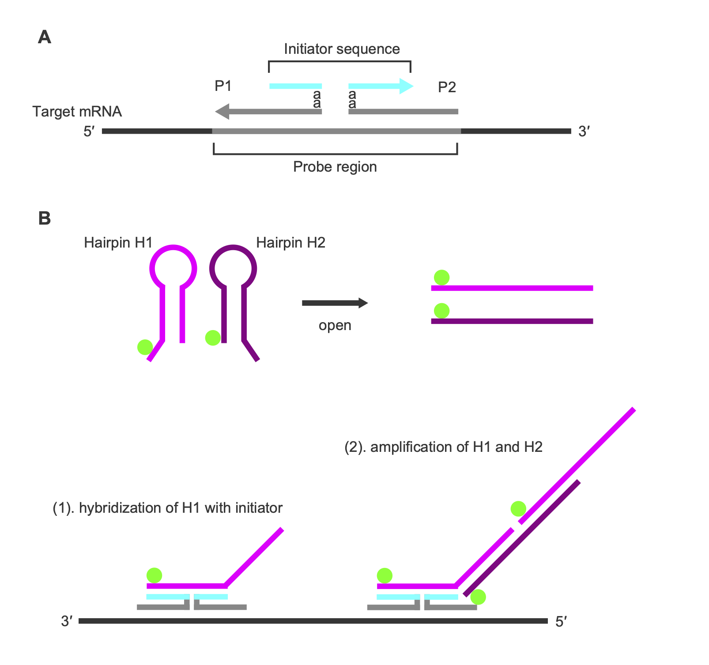
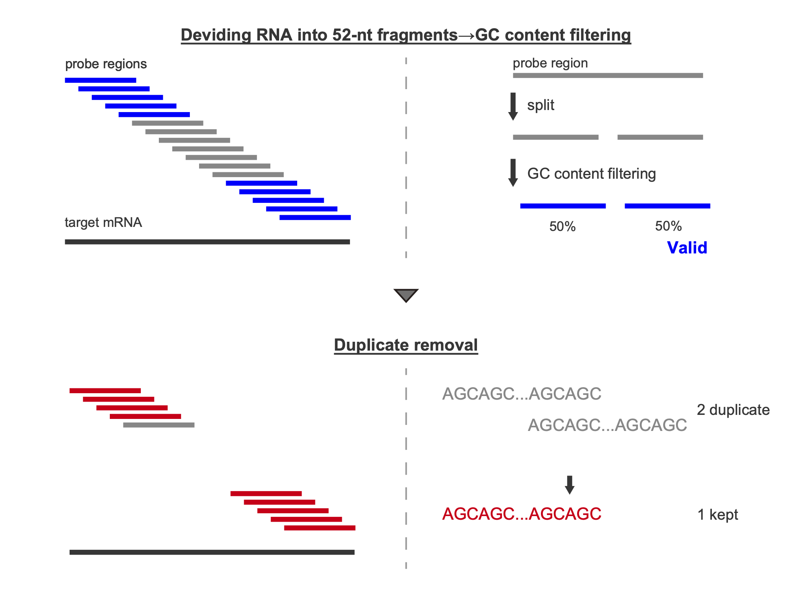
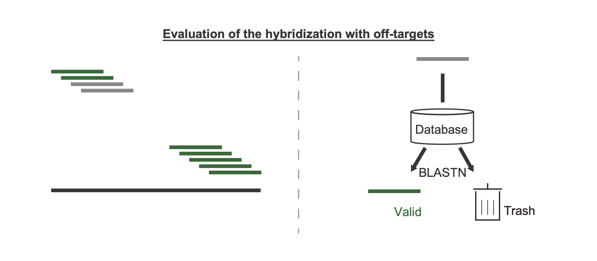
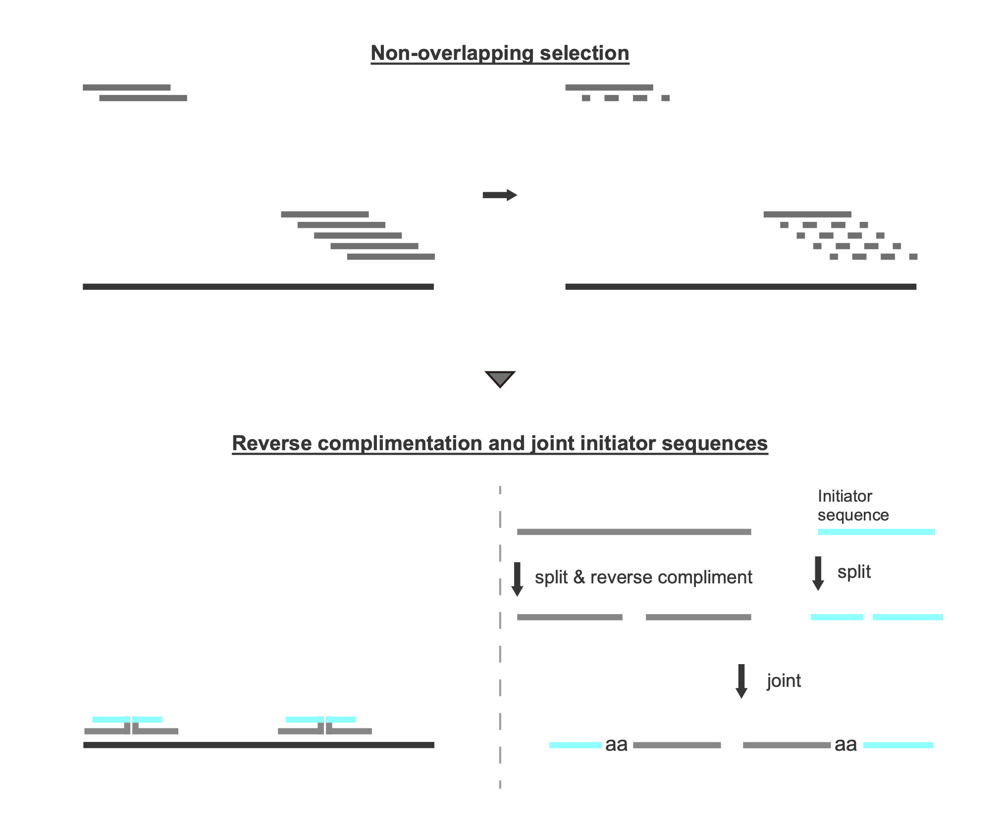

# hcrkit<!-- omit in toc -->

hcrkit is an automated pipeline for design of *in situ* Hybridization Chain Reaction (isHCR) probes. **For beginners, please check [Overview](#overview) section.**

## Table of Contents<!-- omit in toc -->

- [Installation](#installation)
  - [Dependencies](#dependencies)
  - [Setup](#setup)
- [Design isHCR probe](#design-ishcr-probe)
  - [Download reference files from NCBI](#download-reference-files-from-ncbi)
    - [Procedure for download files via NCBI web page](#procedure-for-download-files-via-ncbi-web-page)
    - [Procedure for download files via CLI](#procedure-for-download-files-via-cli)
  - [Identification of on-target transctipts IDs (Optional)](#identification-of-on-target-transctipts-ids-optional)
    - [Parameters](#parameters)
    - [Example of this step](#example-of-this-step)
  - [Running hcrkit](#running-hcrkit)
    - [Parameters](#parameters-1)
    - [Example of this step with some patterns](#example-of-this-step-with-some-patterns)
- [Tips](#tips)
- [Overview](#overview)
  - [What is isHCR (_in situ_ Hybridization Chain Reaction)?](#what-is-ishcr-in-situ-hybridization-chain-reaction)
  - [Guidline for design of probes](#guidline-for-design-of-probes)
  - [Workflow \& algorithm](#workflow--algorithm)
    - [`extract_target_ids.py` (Identification of Target Transcript IDs)](#extract_target_idspy-identification-of-target-transcript-ids)
    - [`hcrkit.py` (automated probe design tool)](#hcrkitpy-automated-probe-design-tool)
- [Citation](#citation)

## Installation

### Dependencies

- Python 3.7+
- BLAST+
- Python packages: BioPython, pandas

**Developed and tested with**:
- Python 3.13.3
- BLAST+ 2.16.0
- BioPython 1.85, pandas 2.3.2

### Setup

1. Prepare for conda
   
   hcrkit can be easily set up using conda, so it is recommended preparation of environment for using conda. If you use Windows machine, Windows Subsystem for Linux and Ubuntu are also required.

2. Clone the repository

   ```bash
   git clone https://github.com/ShuntaYorimoto/hcrkit.git
   cd hcrkit
   ```

4. Create and activate conda environment

   ```bash
   conda env create -f environment.yml
   conda activate hcrkit
   ```

5. Verify installation
   
   For verify success of installation, run below commands and check whether the help guidance is shown.

   ```bash
   hcrkit.py --help
   extract_target_ids.py --help
   blastn -help
   ```

## Design isHCR probe

### Download reference files from NCBI

It is necessary to download a reference RNA sequence file and a gff3-formated annotation file, because hcrkit automatically filters candidate probes that might bind off-target transcripts using BLAST (Details are shown in [Workflow \& algorithm](#workflow--algorithm) section). It is recommended to download files from NCBI to match transcript IDs between a reference RNA sequence file and a gff file.

#### Procedure for download files via NCBI web page

> [!Note]
> New to NCBI downloads? See our [NCBI Download Guide](docs/ncbi_download_guide.md) for step-by-step instructions with screenshots.

1. Go to NCBI Genome database and search for your organism
2. Download `GCF_*_genomic.gff.gz` and `GCF_*_rna.fna.gz` files from ftp server
3. Decompress downloaded files

#### Procedure for download files via CLI

1. Download files with curl to any directory.

   Example:
   
   ```bash
   curl -O https://ftp.ncbi.nlm.nih.gov/genomes/all/GCF/005/508/785/GCF_005508785.2_pea_aphid_22Mar2018_4r6ur_v2/GCF_005508785.2_pea_aphid_22Mar2018_4r6ur_v2_genomic.gff.gz
   curl -O https://ftp.ncbi.nlm.nih.gov/genomes/all/GCF/005/508/785/GCF_005508785.2_pea_aphid_22Mar2018_4r6ur_v2/GCF_005508785.2_pea_aphid_22Mar2018_4r6ur_v2_rna.fna.gz
   ```

3. Decompress files.
  
   ```bash
   gunzip *.gz
   ```

### Identification of on-target transctipts IDs (Optional)

Obtain a list of on-target transcripts IDs with `extract_target_ids.py`. hcrkit automatically removes candidate probes that might bind to transcripts not matching the target transcript IDs. Identification of on-target transctipt IDs is necessary, if the gene encoding the target transcript generates different isoforms, or if a transcript ID of target RNA is unknown. Details are shown in [Workflow \& algorithm](#workflow--algorithm) section.

**Syntax**: 

```bash
extract_target_ids.py -i PATH -s STRING -p STRING
```
#### Parameters

`-i, --input PATH`: Path of gff file<br>

`-s, STRING`: Gene name encoding on-target transicript<br>

`-p, --prefix STRING`: String used as a prefix for output files (* in the output file section)<br>

**Output file**

`*_target_ids.txt`:

- This file is used as argument of `--target_ids` (parameter of `hcrkit.py`).
- Example:
  
  ```
  XM_016802089.2
  XM_016802088.2
  XM_003242475.4
  ```

#### Example of this step

Extract all isoforms of LOC100216490 (nanos-like protein) in pea aphid.

```bash
extract_target_ids.py -i GCF_005508785.2_pea_aphid_22Mar2018_4r6ur_v2_genomic.gff -s LOC100216490 -p ApNos1
```

### Running hcrkit

**Syntax**:

```bash
hcrkit.py -i PATH -d PATH -p STRING --initiator_id ID [OPTIONS]
```

#### Parameters

**Required Parameters**

`-i, --input PATH`: Path to FASTA file of the target RNA sequence

- Example:

  ```fasta
  >XM_003242475.4 PREDICTED: Acyrthosiphon pisum nanos-like protein (LOC100216490), transcript variant X3, mRNA
  AAAAAAATGTATGTTTTGAATTTGAAGTTTAAATTTAAGTGGGTGTTTTCAAGAGGACCCTTATTGCCAAGATATCACAA
  TGAGTGGCCGTAGCAGATTCGCGTTCGGCAGCCAGACCCAGGCGCCCCAGTACCAGAACCGATGCGCTCTGTGCTTGACC
  ...
  ```

`-d, --database PATH`: Path to FASTA file of reference RNAs sequences for BLAST or path to BLAST database

- For running with creation of BLAST database, specify path to the reference RNA sequence (it is also **necessary to specify `--make_db` parameter** for creation of BLAST database).
- For running with using existing BLAST database, specify path of BLAST database. Although multiple files are maked with different file extention as creation of BLAST database, the pre-built BLAST databases can be specifiedby providing the database name without the extension as the argument of this parameter.

`-p, --prefix STRING`: String used as a prefix for output files and a directory

`--initiator_id ID`: The name of fluorescently-labeled hairpin DNA

- The names which can be specified as options are only products lineup of ISHpalette™ Short hairpin amplifier (production of [Nepagene](https://nepagene.jp/en/products/fluorescent-tissue-staining-in-situ-hcr/ishpalette-2)): S23, S41, S45, S72, S73, A161.
- The other names of products can be used, if you specify `--initiator_custom` parameter.

**Optional Parameters**

`--target_ids PATH`: Path to the file of the list of on-target transctipts IDs (The output of `extract_target_ids.py`)

- When this parameter is omitted, hcrkit extract the transcript ID from the FASTA header of `-i, --input PATH`, taking the string up to (but not including) the first whitespace.

`--make_db STRING`: The name for newly creating BLAST database

- `{STRING}_blastdb/`

`--min_gc`, `--max_gc`: The percentege of GC fraction of probe binding sites (default: 45-55%)

- The GC content can be changed with 40–60% (see [Guidline for design of probes](#guidline-for-design-of-probes) section)

`--initiator_custom`: Path to CSV file of custom initiator

- For CSV file of custom initiator, the name of the hairpin DNAs are described in the 1st column and initiator sequences described in the 2nd column.
- Example:
  
  ```csv
  B1,GAGGAGGGCAGCAAACGG
  B2,CCTCGTAAATCCTCATCA
  B3,GTCCCTGCCTCTATATCT
  ```

`--initiator_split INT`: The split position of initiator (default: 9)

- The split of the initiator sequence depends on the hairpin DNA product (When using the ISHpalette™ Short hairpin amplifier, a 20-nt initiator is split into 9 and 12 nt). The initiator sequence in `--initiator_custom` can be split at the nucleotide position you specify.

`-t, --threads`: The number of CPU threads for BLAST (default: 1)

`-h, --help`: Print help information

`-v, --version`: Print version information

**Output Files**

hcrkit outputs following files and directories.

```
{prefix}_out
├─ {prefix}_{initiator}_probe_pairs_gc{min}-{max}.csv
├─ {prefix}_out/{prefix}_{initiator}_probe_summary_gc{min}-{max}.txt`
└─ temp
    ├─ {prefix}_probe_candidates_gc{min}-{max}.fasta
    └─ {prefix}_blast_results_gc{min}-{max}.tsv
```

`{prefix}_{initiator}_probe_pairs_gc{min}-{max}.csv`:

- Probe sequences (This is formatted as order forms for the eurofin genomics).
- Example:
  
  ```csv
  Oligoname,Sequence
  ApNos1_A161_s38_P1,GGTACGCGAaaAAGGGTCCTCTTGAAAACACCCACT
  ApNos1_A161_s38_P2,GGCCACTCATTGTGATATCTTGGCAaaAGGTAGGTGTAA
  ApNos1_A161_s363_P1,GGTACGCGAaaAACTCGGCCAGTGTGTAGTAGTTGG
  ApNos1_A161_s363_P2,TGTTGCATGCGGTTCATGCGCAACAaaAGGTAGGTGTAA
  ...
  ```

`{prefix}_{initiator}_probe_summary_gc{min}-{max}.txt`:

- Summarised information of probes.
- The values of `Max off-target coverage` columns means percentage of bases that matches off-target transcripts in each probe binding sites.
- Example:
  
  ```
  Probe set name    P1                                    P2                                       Max off-target coverage (%)
  ApNos1_A161_s38   GGTACGCGAaaAAGGGTCCTCTTGAAAACACCCACT  GGCCACTCATTGTGATATCTTGGCAaaAGGTAGGTGTAA  0
  ApNos1_A161_s363  GGTACGCGAaaAACTCGGCCAGTGTGTAGTAGTTGG  TGTTGCATGCGGTTCATGCGCAACAaaAGGTAGGTGTAA  0
  ...
  ```

`{prefix}_probe_candidates_gc{min}-{max}.fasta`

- All potential probe sequences before specificity filtering.
- Example:

  ```
  >XM_003242475.4_probe_38_89
  AGTGGGTGTTTTCAAGAGGACCCTTATTGCCAAGATATCACAATGAGTGGCC
  >XM_003242475.4_probe_39_90
  GTGGGTGTTTTCAAGAGGACCCTTATTGCCAAGATATCACAATGAGTGGCCG
  ...
  ```

`{prefix}_blast_results_gc{min}-{max}.tsv`

- The raw results of BLAST written in output format 6.
- Example:
  
  ```
  XM_003242475.4_probe_38_89	XM_003242475.4	100.000	52	0	0	1	52	38	89	1.68e-22	103
  XM_003242475.4_probe_38_89	XM_016802088.2	100.000	21	0	0	32	52	231	251	5.30e-04	42.1
  ...
  ```

#### Example of this step with some patterns

Running hcrkit with creation of BLAST database (the first time).

```bash
hcrkit.py -i ApDll.fasta -d GCF_005508785.2_pea_aphid_22Mar2018_4r6ur_v2_rna.fna -p ApDll --initiator_id A161 --make_db Apis -t 4
```

Running hcrkit with using existing database.

```bash
hcrkit.py -i ApVas1.fasta -d Apis_blastdb/Apis -p ApVas1 --initiator_id S73 -t 4
```

Running hcrkit with target IDs.

```bash
hcrkit.py -i ApNos1.fasta -d Apis_blastdb/Apis -p ApNos1 --initiator_id A161 --target_ids ApNos1_out/ApNos1_target_ids.txt -t 4
```

## Tips

The number of probes would affect the RNA detection. Starting the experiment with a 10-probe set might be a good. The larger number of probes may enable detection of low-copy RNAs.<br>

**If the number of probes were few...**

- Relax GC content requirements from default to 40-60% with `--min_gc` & `--max_gc` parameters:
  
  ```bash
  hcrkit -i target.fasta -d database -p output --initiator_id A161 --min_gc 40 --max_gc 60
  ```

- Review the on-target list:

  Verify that `*_target_ids.txt` contains all relevant transcript IDs, because missing transcripts which is on-target may cause incorrect filtering.

## Overview

### What is isHCR (_in situ_ Hybridization Chain Reaction)?

isHCR is a powerful technique for RNA detection *in situ*. Unlike enzyme-based methods, isHCR visualize RNAs though formation of polymor composed with fluorescently-labeled oligos.<br>


<p align="center"> Figure 1 </p>

The probe contains an initiator sequence (Figure 1A). The initiator hybridizes with hairpin DNAs, triggering a hybridization chain reaction that produces fluorescently labeled polymers (Figure 1B). To repress background signals, the probe is split (P1 and P2), and the pair of probes can efficiently trigger amplification.

### Guidline for design of probes

-	GC content: 40–60% (45–55% recomended). 
-	For each probe pair, sequence identity with off-target RNAs: ≤ 50% (verify with BLAST).
-	Design region in target RNA: CDS + UTR (CDS recomended).

### Workflow & algorithm

#### `extract_target_ids.py` (Identification of Target Transcript IDs)

**Scope**<br>

Obtain a list of on-target transcripts IDs. This program is useful when gene encoding the target transcript generates different isoforms or when a ID of target transcript is unknown.

1. Exaple 1 (When gene encodeing target mRNA has multiple isoforms)
   
   The *Drosophila melanogaster nanos* gene encodes two isoforms, *nanos-RA* and *nanos-RB*. When the user inputs the sequence of　*nanos-RA* into hcrkit, hcrkit recognizes the ID of *nanos-RA* as on-target, but not the ID of *nanos-RB*. Because *nanos-RA* and *nanos-RB* share a wide range of sequences, hcrkit cannot design many probes. `extract_target_ids.py` automatically provides IDs for both isoforms, enabling hcrkit to design probes correctly.

2. Exaple 2 (When the transcript ID is unknown)
   
   It can be difficult to find the correct transcript ID depending on the database. For example, a FASTA file of *nanos-RA* from FlyBase contains a FlyBase ID, whereas hcrkit (= BLAST database) uses NCBI IDs. Since finding the NCBI-format ID within FlyBase is often difficult, hcrkit does not function correctly. `extract_target_ids.py` easily seraches IDs in NCBI format.

> [!Note]
> User can skip this program only if target mRNA has no isoforms and the FASTA header of the target transciript starts with an NCBI-format ID.

**Overview of algorithm**<br>

1. **Extract rows for mRNAs from GFF**

   In a GFF file, 3rd column contains the feature type (e.g., gene, mRNA, exon, CDS), and 9th column contains the attributes (including information such as ID and gene name). This program extracts rows where the feature type is mRNA.

2. **Search all rows containing gene name of target transcript**
   
   In the attributes field, the gene name for each mRNA appears as `gene=`. User can provide the gene name via `-s` option when running the program. The program then selects rows whose `gene=` value exactly matches the specified gene name.

3. **Identify IDs**
   
   From the rows selected in step 2, the program identifies all transcript IDs. The program takes `ID=` value from each attributes field, and removes the `"rna-"` prefix, and then outputs the ID-list as a txt file.

#### `hcrkit.py` (automated probe design tool)

The program automates probe design through three Python scripts (steps 1–3) that work together seamlessly.

**Step 1: Creation of candidate probe binding sites & 1st filtering**



1. **Dividing RNA into 52-nt fragments**
   
   Region hybridized with a probe pair, probe region, is 52 nt (Figure1). This program devides transcript into 52-nt fragments from the 5′ to the 3′ end.

2. **GC content filtering**
   
   This program splits the probe region into 25 nt segments at the 5′ and 3′ ends (= probe binding sites), and retains them whose GC content meets the criteria.  

3. **Duplicate removal**
   
   If duplicate probe candidates with the same sequence are generated, this program keep one and remove the rest.

**Step 2: 2nd filtering**



The program evaluates sequence identity between each candidate probe region and potential off-targets using BLAST. It distinguishes IDs of on-targets and off-targets based on a list of on-target IDs provided by user (these IDs can be easily generated with `extract_target_ids.py`). The program removes probe regions whose sequence identity with off-targets exceeds 50%.

**Step 3: Selection non-overlapping probe binding sites & formatting for isHCR split probes**



1. **Non-overlapping selection**
   
   The candidates for probe regions often overlap. This program select the non-overlapping regions by greedy algorithm. The greedy algorithm selects regions from the 5′ end that do not overlap.

2. **Reverse complimentation and joint initiator sequences**
   
   Because probe regions are sense strand sequences, the program reverse-complements them to convert into antisense strand sequences. <br>The sequences split into 25 nt segments at the 5′ and 3′ ends, and then they were conjugated with partial initiator sequences. 

## Citation

Preparing...