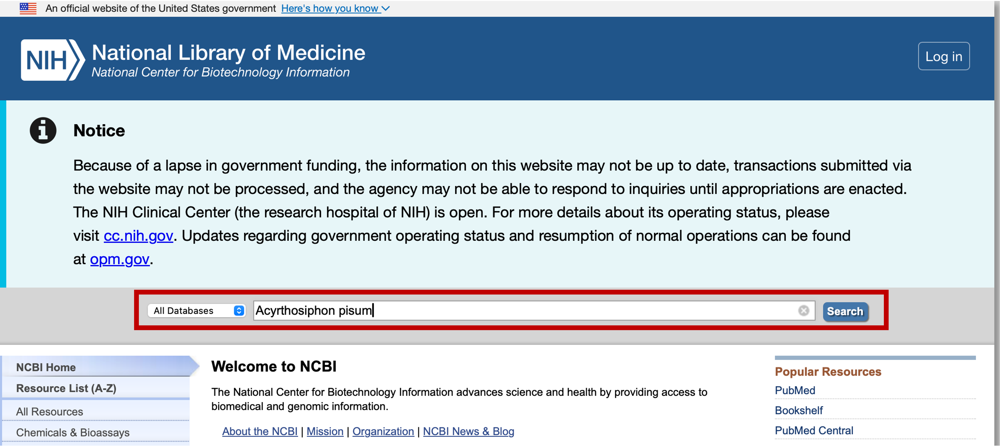
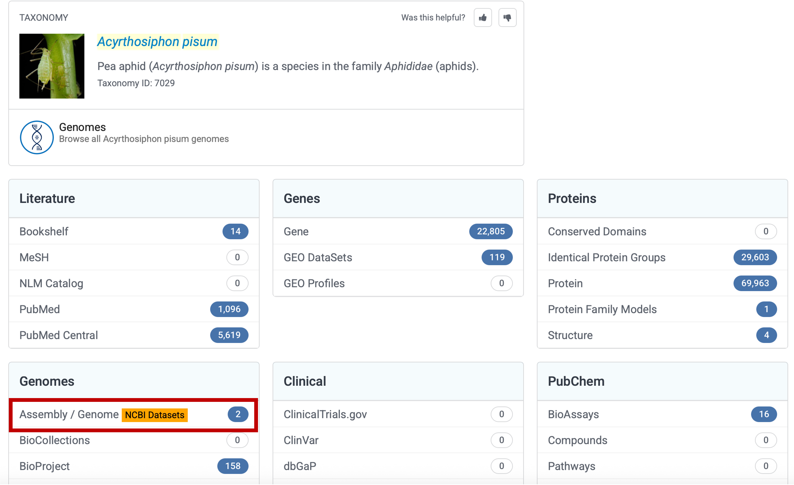
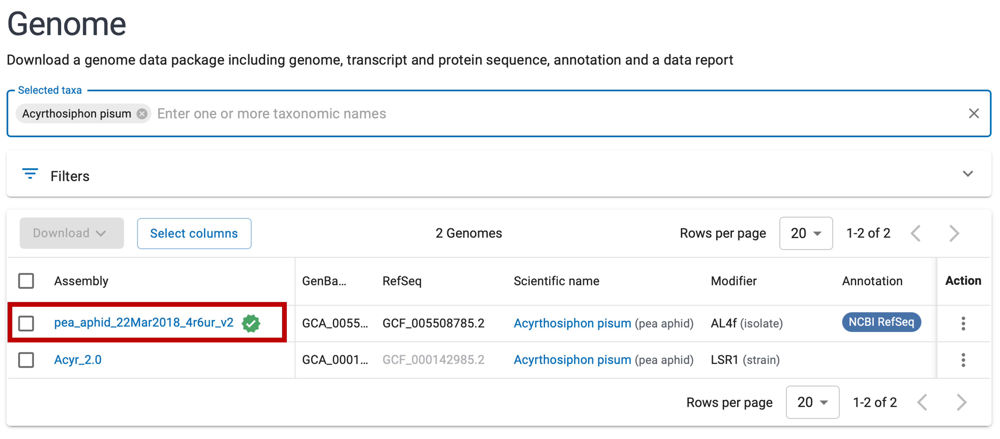
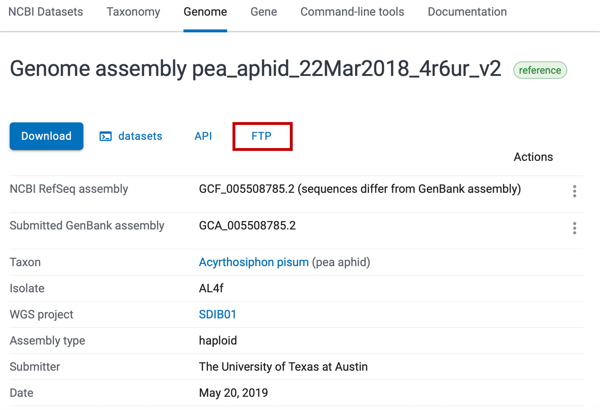
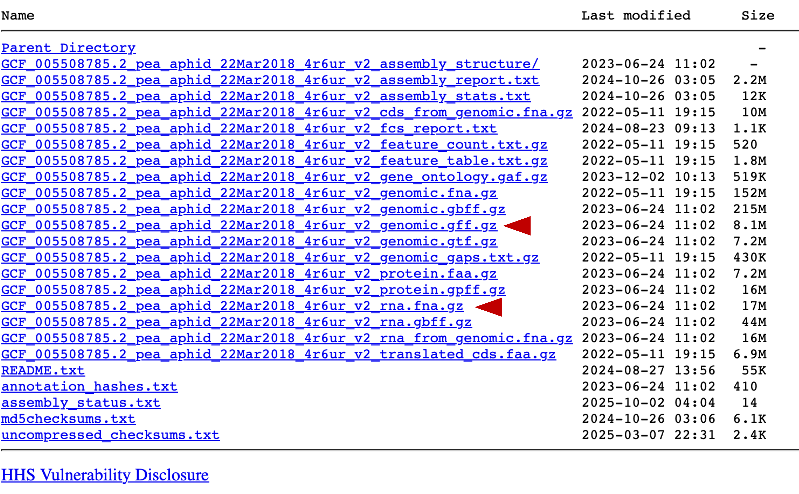

# How to Download GFF and Reference RNA Sequences Files 

## Note
This document was created on October 3, 2025.  
The NCBI (National Center of Biotechnology Information) interface may change over time. 

## Download
1. **Access NCBI homepage** at [https://www.ncbi.nlm.nih.gov](https://www.ncbi.nlm.nih.gov) and enter your species name in the search bar.   
||
|:-:|
 

2. **Click "Assembly/Genomes"**.  
||
|:-:|
 

3. **Select an appropriate assembly** for your experiments. In most cases, choose the assembly marked as the reference genome (indicated by a green checkmark).  
||
|:-:|
 

4. **Click "FTP"**.   
||
|:-:|
 

5. **Download the required files**.  
- `GCF_*_genomic.gff.gz`: gene annotations
- `GCF_*_rna.fna.gz`: transcript sequences
||
|:-:|
 

> [!IMPORTANT]
These files can exceed 10 GB. Ensure sufficient storage capacity before downloading.
> 
